# 🔐 Sistema de Autenticação - PlutusGrip API

## Visão Geral

O PlutusGrip API utiliza um sistema de autenticação baseado em **JWT (JSON Web Tokens)** com tokens de acesso e atualização separados, proporcionando segurança robusta e experiência de usuário fluida.

## 📋 Índice

- [Arquitetura](#arquitetura)
- [Fluxo de Autenticação](#fluxo-de-autenticação)
- [Endpoints](#endpoints)
- [Segurança](#segurança)
- [Exemplos de Uso](#exemplos-de-uso)
- [Tratamento de Erros](#tratamento-de-erros)
- [Boas Práticas](#boas-práticas)

---

## Arquitetura

### Componentes Principais

```
┌─────────────────────┐
│   FastAPI Routes    │  ← Endpoints de Auth
├─────────────────────┤
│   AuthService       │  ← Lógica de negócio
├─────────────────────┤
│   UserRepository    │  ← Acesso ao banco
├─────────────────────┤
│   Security Utils    │  ← JWT & Hashing
├─────────────────────┤
│   Token Blacklist   │  ← Invalidação de tokens
└─────────────────────┘
```

### Tecnologias Utilizadas

- **FastAPI**: Framework web moderno
- **passlib + bcrypt**: Hash de senhas
- **python-jose**: Geração e validação de JWT
- **slowapi**: Rate limiting
- **PostgreSQL**: Armazenamento de usuários

---

## Fluxo de Autenticação

### 1. Registro de Novo Usuário

```mermaid
sequenceDiagram
    Cliente->>API: POST /auth/register
    API->>Validador: Validar senha forte
    Validador-->>API: OK
    API->>Banco: Verificar email duplicado
    Banco-->>API: Email disponível
    API->>Security: Hash da senha
    Security-->>API: Senha hasheada
    API->>Banco: Criar usuário
    Banco-->>API: Usuário criado
    API-->>Cliente: 201 Created
```



### 2. Login

```mermaid
sequenceDiagram
    Cliente->>API: POST /auth/login
    API->>Banco: Buscar usuário por email
    Banco-->>API: Usuário encontrado
    API->>Security: Verificar senha
    Security-->>API: Senha válida
    API->>Security: Gerar Access Token (30min)
    API->>Security: Gerar Refresh Token (7 dias)
    API-->>Cliente: Tokens + Dados do usuário
```



### 3. Acesso a Recursos Protegidos

```mermaid
sequenceDiagram
    Cliente->>API: GET /auth/me (Bearer Token)
    API->>Blacklist: Token está revogado?
    Blacklist-->>API: Não
    API->>Security: Decodificar token
    Security-->>API: Token válido
    API->>Banco: Buscar usuário
    Banco-->>API: Usuário encontrado
    API-->>Cliente: Dados do usuário
```



### 4. Refresh Token

```mermaid
sequenceDiagram
    Cliente->>API: POST /auth/refresh
    API->>Security: Decodificar refresh token
    Security-->>API: Token válido (type=refresh)
    API->>Banco: Verificar usuário existe
    Banco-->>API: Usuário válido
    API->>Security: Gerar novo Access Token
    API-->>Cliente: Novo Access Token
```



### 5. Logout

```mermaid
sequenceDiagram
    Cliente->>API: POST /auth/logout (Bearer Token)
    API->>Blacklist: Adicionar token à blacklist
    Blacklist-->>API: Token adicionado
    API-->>Cliente: 200 OK
    Cliente->>Cliente: Remover token do storage
```



---

## Endpoints

### POST /api/auth/register

Registra um novo usuário no sistema.

**Rate Limit:** 3 requisições por hora por IP

**Request Body:**
```json
{
  "name": "João Silva",
  "email": "joao.silva@email.com",
  "password": "Senha@123"
}
```

**Validações de Senha:**
- Mínimo de 8 caracteres
- Pelo menos 1 letra maiúscula
- Pelo menos 1 letra minúscula
- Pelo menos 1 dígito
- Pelo menos 1 caractere especial (!@#$%^&*(),.?":{}|<>)

**Response (201 Created):**
```json
{
  "id": 1,
  "name": "João Silva",
  "email": "joao.silva@email.com",
  "currency": "BRL",
  "timezone": "UTC",
  "created_at": "2025-01-29T10:30:00Z",
  "updated_at": "2025-01-29T10:30:00Z"
}
```

**Erros Possíveis:**
- `409 Conflict`: Email já cadastrado
- `422 Unprocessable Entity`: Senha fraca ou dados inválidos
- `429 Too Many Requests`: Limite de taxa excedido

---

### POST /api/auth/login

Autentica um usuário e retorna tokens JWT.

**Rate Limit:** 5 requisições por 15 minutos por IP

**Request Body:**
```json
{
  "email": "joao.silva@email.com",
  "password": "Senha@123"
}
```

**Response (200 OK):**
```json
{
  "access_token": "eyJhbGciOiJIUzI1NiIsInR5cCI6IkpXVCJ9...",
  "refresh_token": "eyJhbGciOiJIUzI1NiIsInR5cCI6IkpXVCJ9...",
  "token_type": "bearer",
  "user": {
    "id": 1,
    "name": "João Silva",
    "email": "joao.silva@email.com",
    "currency": "BRL",
    "timezone": "UTC",
    "created_at": "2025-01-29T10:30:00Z",
    "updated_at": "2025-01-29T10:30:00Z"
  }
}
```

**Erros Possíveis:**
- `401 Unauthorized`: Email ou senha incorretos
- `429 Too Many Requests`: Limite de taxa excedido

---

### POST /api/auth/refresh

Gera um novo access token usando um refresh token válido.

**Request Body:**
```json
{
  "refresh_token": "eyJhbGciOiJIUzI1NiIsInR5cCI6IkpXVCJ9..."
}
```

**Response (200 OK):**
```json
{
  "access_token": "eyJhbGciOiJIUzI1NiIsInR5cCI6IkpXVCJ9...",
  "token_type": "bearer"
}
```

**Erros Possíveis:**
- `401 Unauthorized`: Refresh token inválido ou expirado

---

### POST /api/auth/logout

Invalida o access token atual (adiciona à blacklist).

**Headers:**
```
Authorization: Bearer <access_token>
```

**Response (200 OK):**
```json
{
  "message": "Successfully logged out",
  "detail": "Token has been revoked. Please remove it from client storage."
}
```

**Erros Possíveis:**
- `401 Unauthorized`: Token inválido ou expirado

**⚠️ Importante:** O cliente deve remover os tokens do armazenamento local após o logout.

---

### GET /api/auth/me

Retorna os dados do usuário autenticado.

**Headers:**
```
Authorization: Bearer <access_token>
```

**Response (200 OK):**
```json
{
  "id": 1,
  "name": "João Silva",
  "email": "joao.silva@email.com",
  "currency": "BRL",
  "timezone": "UTC",
  "created_at": "2025-01-29T10:30:00Z",
  "updated_at": "2025-01-29T10:30:00Z"
}
```

**Erros Possíveis:**
- `401 Unauthorized`: Token inválido, expirado ou revogado

---

## Segurança

### 1. Hash de Senhas

- **Algoritmo:** bcrypt
- **Configuração:** Esquema bcrypt via passlib
- **Força:** Rounds adaptativos para segurança contra ataques de força bruta

```python
# Exemplo de verificação
from passlib.context import CryptContext

pwd_context = CryptContext(schemes=["bcrypt"], deprecated="auto")
hashed = pwd_context.hash("Senha@123")
is_valid = pwd_context.verify("Senha@123", hashed)
```

### 2. JWT Tokens

#### Access Token
- **Tempo de Vida:** 30 minutos
- **Algoritmo:** HS256
- **Payload:**
  ```json
  {
    "sub": "1",           # User ID
    "exp": 1706535000,    # Expiration timestamp
    "type": "access"      # Token type
  }
  ```

#### Refresh Token
- **Tempo de Vida:** 7 dias
- **Algoritmo:** HS256
- **Payload:**
  ```json
  {
    "sub": "1",           # User ID
    "exp": 1707139800,    # Expiration timestamp
    "type": "refresh"     # Token type
  }
  ```

### 3. Token Blacklist

- **Implementação:** In-memory set (adequado para instância única)
- **Produção:** Recomenda-se Redis para múltiplas instâncias
- **Funcionamento:**
  - Tokens adicionados ao blacklist no logout
  - Verificação automática em cada requisição autenticada
  - Tokens blacklistados retornam 401 Unauthorized

```python
# Estrutura da blacklist
_token_blacklist: set = set()

# Adicionar token
blacklist_token(token)

# Verificar
is_blacklisted = is_token_blacklisted(token)
```

### 4. Rate Limiting

Proteção contra ataques de força bruta e abuso:

| Endpoint | Limite | Janela |
|----------|--------|---------|
| `/auth/register` | 3 requisições | 1 hora |
| `/auth/login` | 5 requisições | 15 minutos |

**Resposta quando limitado:**
```json
{
  "error": "Rate limit exceeded",
  "detail": "5 per 15 minutes"
}
```

### 5. Validação de Senha Forte

Requisitos obrigatórios para registro:

- ✅ Mínimo 8 caracteres
- ✅ Letra maiúscula (A-Z)
- ✅ Letra minúscula (a-z)
- ✅ Dígito (0-9)
- ✅ Caractere especial (!@#$%^&*(),.?":{}|<>)

**Mensagens de Erro:**
```json
{
  "detail": [
    {
      "type": "value_error",
      "loc": ["body", "password"],
      "msg": "Password must contain at least one uppercase letter"
    }
  ]
}
```

---

## Exemplos de Uso

### cURL

#### Registro
```bash
curl -X POST "http://localhost:8000/api/auth/register" \
  -H "Content-Type: application/json" \
  -d '{
    "name": "João Silva",
    "email": "joao.silva@email.com",
    "password": "Senha@123"
  }'
```

#### Login
```bash
curl -X POST "http://localhost:8000/api/auth/login" \
  -H "Content-Type: application/json" \
  -d '{
    "email": "joao.silva@email.com",
    "password": "Senha@123"
  }'
```

#### Acessar Recurso Protegido
```bash
curl -X GET "http://localhost:8000/api/auth/me" \
  -H "Authorization: Bearer <access_token>"
```

#### Refresh Token
```bash
curl -X POST "http://localhost:8000/api/auth/refresh" \
  -H "Content-Type: application/json" \
  -d '{
    "refresh_token": "<refresh_token>"
  }'
```

#### Logout
```bash
curl -X POST "http://localhost:8000/api/auth/logout" \
  -H "Authorization: Bearer <access_token>"
```

---

### JavaScript (Fetch API)

```javascript
class AuthClient {
  constructor(baseURL = 'http://localhost:8000') {
    this.baseURL = baseURL;
    this.accessToken = localStorage.getItem('access_token');
    this.refreshToken = localStorage.getItem('refresh_token');
  }

  async register(name, email, password) {
    const response = await fetch(`${this.baseURL}/api/auth/register`, {
      method: 'POST',
      headers: { 'Content-Type': 'application/json' },
      body: JSON.stringify({ name, email, password })
    });

    if (!response.ok) {
      const error = await response.json();
      throw new Error(error.detail);
    }

    return await response.json();
  }

  async login(email, password) {
    const response = await fetch(`${this.baseURL}/api/auth/login`, {
      method: 'POST',
      headers: { 'Content-Type': 'application/json' },
      body: JSON.stringify({ email, password })
    });

    if (!response.ok) {
      throw new Error('Invalid credentials');
    }

    const data = await response.json();

    // Armazenar tokens
    this.accessToken = data.access_token;
    this.refreshToken = data.refresh_token;
    localStorage.setItem('access_token', data.access_token);
    localStorage.setItem('refresh_token', data.refresh_token);

    return data;
  }

  async getMe() {
    const response = await fetch(`${this.baseURL}/api/auth/me`, {
      headers: {
        'Authorization': `Bearer ${this.accessToken}`
      }
    });

    if (response.status === 401) {
      // Token expirado, tentar refresh
      await this.refresh();
      return this.getMe(); // Retry
    }

    if (!response.ok) {
      throw new Error('Failed to fetch user data');
    }

    return await response.json();
  }

  async refresh() {
    const response = await fetch(`${this.baseURL}/api/auth/refresh`, {
      method: 'POST',
      headers: { 'Content-Type': 'application/json' },
      body: JSON.stringify({ refresh_token: this.refreshToken })
    });

    if (!response.ok) {
      // Refresh token inválido, fazer logout
      this.logout();
      throw new Error('Session expired. Please login again.');
    }

    const data = await response.json();

    // Atualizar access token
    this.accessToken = data.access_token;
    localStorage.setItem('access_token', data.access_token);

    return data;
  }

  async logout() {
    try {
      await fetch(`${this.baseURL}/api/auth/logout`, {
        method: 'POST',
        headers: {
          'Authorization': `Bearer ${this.accessToken}`
        }
      });
    } catch (error) {
      console.error('Logout error:', error);
    } finally {
      // Limpar tokens independente do resultado
      this.accessToken = null;
      this.refreshToken = null;
      localStorage.removeItem('access_token');
      localStorage.removeItem('refresh_token');
    }
  }
}

// Uso
const auth = new AuthClient();

// Registro
try {
  await auth.register('João Silva', 'joao@email.com', 'Senha@123');
  console.log('Registered successfully!');
} catch (error) {
  console.error('Registration error:', error.message);
}

// Login
try {
  const result = await auth.login('joao@email.com', 'Senha@123');
  console.log('Logged in:', result.user);
} catch (error) {
  console.error('Login error:', error.message);
}

// Obter dados do usuário
try {
  const user = await auth.getMe();
  console.log('Current user:', user);
} catch (error) {
  console.error('Error:', error.message);
}

// Logout
await auth.logout();
```

---

### Python (requests)

```python
import requests
from typing import Optional, Dict

class PlutusGripAuth:
    def __init__(self, base_url: str = "http://localhost:8000"):
        self.base_url = base_url
        self.access_token: Optional[str] = None
        self.refresh_token: Optional[str] = None

    def register(self, name: str, email: str, password: str) -> Dict:
        """Register a new user"""
        response = requests.post(
            f"{self.base_url}/api/auth/register",
            json={"name": name, "email": email, "password": password}
        )
        response.raise_for_status()
        return response.json()

    def login(self, email: str, password: str) -> Dict:
        """Login and store tokens"""
        response = requests.post(
            f"{self.base_url}/api/auth/login",
            json={"email": email, "password": password}
        )
        response.raise_for_status()

        data = response.json()
        self.access_token = data["access_token"]
        self.refresh_token = data["refresh_token"]

        return data

    def get_me(self) -> Dict:
        """Get current user data"""
        response = requests.get(
            f"{self.base_url}/api/auth/me",
            headers={"Authorization": f"Bearer {self.access_token}"}
        )

        if response.status_code == 401:
            # Try to refresh token
            self.refresh()
            return self.get_me()  # Retry

        response.raise_for_status()
        return response.json()

    def refresh(self) -> Dict:
        """Refresh access token"""
        response = requests.post(
            f"{self.base_url}/api/auth/refresh",
            json={"refresh_token": self.refresh_token}
        )
        response.raise_for_status()

        data = response.json()
        self.access_token = data["access_token"]

        return data

    def logout(self) -> None:
        """Logout user"""
        try:
            requests.post(
                f"{self.base_url}/api/auth/logout",
                headers={"Authorization": f"Bearer {self.access_token}"}
            )
        finally:
            self.access_token = None
            self.refresh_token = None

# Usage
auth = PlutusGripAuth()

# Register
user = auth.register("João Silva", "joao@email.com", "Senha@123")
print(f"Registered: {user['name']}")

# Login
result = auth.login("joao@email.com", "Senha@123")
print(f"Logged in: {result['user']['name']}")

# Get user data
me = auth.get_me()
print(f"Current user: {me['email']}")

# Logout
auth.logout()
```

---

## Tratamento de Erros

### Códigos de Status HTTP

| Código | Significado | Quando Ocorre |
|--------|-------------|---------------|
| `200 OK` | Sucesso | Login, refresh, logout, me |
| `201 Created` | Recurso criado | Registro bem-sucedido |
| `401 Unauthorized` | Não autorizado | Credenciais inválidas, token inválido/expirado/revogado |
| `409 Conflict` | Conflito | Email já cadastrado |
| `422 Unprocessable Entity` | Dados inválidos | Validação de senha fraca, email inválido |
| `429 Too Many Requests` | Rate limit excedido | Muitas tentativas de login/registro |
| `500 Internal Server Error` | Erro do servidor | Erro inesperado |

### Formato de Resposta de Erro

```json
{
  "detail": "Error message description"
}
```

### Erro de Validação (422)

```json
{
  "detail": [
    {
      "type": "value_error",
      "loc": ["body", "password"],
      "msg": "Password must contain at least one digit",
      "input": "SenhaFraca"
    }
  ]
}
```

### Rate Limit (429)

```json
{
  "error": "Rate limit exceeded",
  "detail": "5 per 15 minutes"
}
```

---

## Boas Práticas

### Para Desenvolvedores Frontend

1. **Armazenamento de Tokens**
   - ✅ Use `localStorage` para aplicações web single-page
   - ✅ Use `httpOnly cookies` para máxima segurança (requer configuração no backend)
   - ❌ Nunca armazene tokens em `sessionStorage` para autenticação persistente

2. **Renovação Automática de Tokens**
   ```javascript
   // Interceptor para renovar token automaticamente
   async function fetchWithAuth(url, options = {}) {
     const response = await fetch(url, {
       ...options,
       headers: {
         ...options.headers,
         'Authorization': `Bearer ${getAccessToken()}`
       }
     });

     if (response.status === 401) {
       // Token expirado, tentar refresh
       await refreshAccessToken();
       // Retry original request
       return fetch(url, {
         ...options,
         headers: {
           ...options.headers,
           'Authorization': `Bearer ${getAccessToken()}`
         }
       });
     }

     return response;
   }
   ```

3. **Logout Completo**
   ```javascript
   async function logout() {
     // 1. Chamar endpoint de logout
     await fetch('/api/auth/logout', {
       method: 'POST',
       headers: { 'Authorization': `Bearer ${token}` }
     });

     // 2. Limpar storage
     localStorage.removeItem('access_token');
     localStorage.removeItem('refresh_token');

     // 3. Redirecionar para login
     window.location.href = '/login';
   }
   ```

4. **Tratamento de Erros de Rate Limit**
   ```javascript
   async function login(email, password) {
     try {
       const response = await fetch('/api/auth/login', {
         method: 'POST',
         headers: { 'Content-Type': 'application/json' },
         body: JSON.stringify({ email, password })
       });

       if (response.status === 429) {
         const retry = response.headers.get('Retry-After');
         alert(`Too many attempts. Try again in ${retry} seconds.`);
         return;
       }

       // ... handle success
     } catch (error) {
       // ... handle error
     }
   }
   ```

### Para Desenvolvedores Backend

1. **Variáveis de Ambiente**
   ```bash
   # .env
   SECRET_KEY=your-super-secret-key-change-in-production
   ALGORITHM=HS256
   ACCESS_TOKEN_EXPIRE_MINUTES=30
   REFRESH_TOKEN_EXPIRE_DAYS=7
   ```

2. **Validação de Entrada**
   - ✅ Sempre use Pydantic schemas para validação
   - ✅ Implemente validadores customizados para regras de negócio
   - ✅ Retorne mensagens de erro claras e acionáveis

3. **Segurança**
   - ✅ Nunca retorne senhas hasheadas nas respostas
   - ✅ Use HTTPS em produção
   - ✅ Configure CORS adequadamente
   - ✅ Implemente rate limiting em todos os endpoints sensíveis
   - ✅ Log de tentativas de autenticação falhadas

4. **Testes**
   ```python
   # Exemplo de teste
   async def test_register_user():
       response = await client.post("/api/auth/register", json={
           "name": "Test User",
           "email": "test@example.com",
           "password": "Test@123"
       })
       assert response.status_code == 201
       assert "id" in response.json()
   ```

5. **Migração para Produção**
   - ✅ Migre blacklist para Redis
   - ✅ Configure refresh tokens no banco de dados
   - ✅ Implemente audit logging
   - ✅ Configure monitoramento de taxa de erro
   - ✅ Considere 2FA para usuários sensíveis

---

## FAQ

**Q: O que fazer se um usuário esquecer a senha?**
A: Atualmente não implementado. Planeje adicionar endpoints de reset de senha com tokens por email.

**Q: Posso usar o refresh token várias vezes?**
A: Sim, o refresh token pode ser reutilizado até expirar (7 dias). Cada uso gera um novo access token.

**Q: O que acontece se eu fizer logout mas continuar usando o access token?**
A: O token ficará na blacklist e todas as requisições retornarão 401 Unauthorized.

**Q: Como escalar o sistema de blacklist para múltiplas instâncias?**
A: Substitua o set em memória por Redis:
```python
import redis
redis_client = redis.Redis(host='localhost', port=6379)

def blacklist_token(token: str):
    redis_client.setex(f"blacklist:{token}", 3600, "1")

def is_token_blacklisted(token: str) -> bool:
    return redis_client.exists(f"blacklist:{token}")
```

**Q: Qual a diferença entre access token e refresh token?**
A: Access tokens são de curta duração (30min) para acessar recursos. Refresh tokens são de longa duração (7 dias) apenas para obter novos access tokens.

---

## Roadmap Futuro

- [ ] Reset de senha por email
- [ ] Verificação de email no registro
- [ ] Two-Factor Authentication (2FA)
- [ ] OAuth2 (Google, GitHub)
- [ ] Device tracking e gerenciamento de sessões
- [ ] Refresh token rotation
- [ ] Blacklist baseado em Redis
- [ ] Audit logging completo

---

**Última atualização:** 29/01/2025
**Versão:** P0.2
