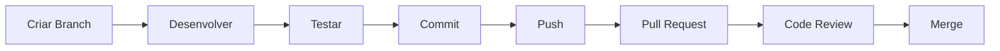

# 💻 Guia de Desenvolvimento

<div align="center">

**Convenções, workflows e boas práticas para desenvolvimento no PlutusGrip Finance Tracker**

[⬅️ Voltar ao Índice](./00-indice.md)

</div>

---

## 📋 Índice

- [Configuração do Ambiente](#-configuração-do-ambiente)
- [Workflow de Desenvolvimento](#-workflow-de-desenvolvimento)
- [Convenções de Código](#-convenções-de-código)
- [Git Workflow](#-git-workflow)
- [Como Adicionar Novas Features](#-como-adicionar-novas-features)
- [Como Criar Novos Componentes](#-como-criar-novos-componentes)
- [Boas Práticas de Testes](#-boas-práticas-de-testes)
- [Deploy e Build](#-deploy-e-build)
- [Troubleshooting](#-troubleshooting)
- [Como Contribuir](#-como-contribuir)

---

## ⚙️ Configuração do Ambiente

### Pré-requisitos

Certifique-se de ter instalado:

```bash
# Node.js >= 18.0.0
node --version

# npm ou yarn
npm --version

# Git
git --version
```

### Setup Inicial

1. **Clone o repositório**
```bash
git clone https://github.com/seu-usuario/plutsgrip-front-react.git
cd plutsgrip-front-react
```

2. **Instale as dependências**
```bash
npm install
```

3. **Configure variáveis de ambiente** (opcional)
```bash
# Crie um arquivo .env na raiz
VITE_API_URL=http://localhost:8000/api
VITE_EXCHANGE_API_URL=https://api.exchangerate-api.com/v4/latest/USD
```

4. **Inicie o servidor de desenvolvimento**
```bash
npm run dev
```

5. **Abra no navegador**
```
http://localhost:5173
```

### Extensões Recomendadas (VS Code)

```json
{
  "recommendations": [
    "dbaeumer.vscode-eslint",
    "esbenp.prettier-vscode",
    "bradlc.vscode-tailwindcss",
    "ms-vscode.vscode-typescript-next",
    "vitest.explorer"
  ]
}
```

---

## 🔄 Workflow de Desenvolvimento

### Ciclo Típico de Desenvolvimento



### 1. Criar Nova Branch

```bash
# Para nova feature
git checkout -b feature/nome-da-feature

# Para bug fix
git checkout -b fix/nome-do-bug

# Para documentação
git checkout -b docs/nome-do-doc
```

### 2. Desenvolver

- Siga as [convenções de código](#-convenções-de-código)
- Escreva código limpo e reutilizável
- Adicione comentários quando necessário
- Use TypeScript para type safety

### 3. Testar

```bash
# Executar todos os testes
npm run test

# Executar testes em watch mode
npm run test -- --watch

# Verificar cobertura
npm run test:coverage

# Executar lint
npm run lint
```

### 4. Commit

```bash
git add .
git commit -m "feat: adiciona novo componente de notificações"
```

### 5. Push e Pull Request

```bash
git push origin feature/nome-da-feature
```

Abra um Pull Request no GitHub seguindo o [template de PR](#template-de-pull-request).

---

## 📝 Convenções de Código

### TypeScript

#### Nomes de Arquivos

```
✅ Correto:
- Button.tsx (componente)
- Button.test.tsx (teste)
- useAuth.ts (hook)
- types.ts (tipos)
- utils.ts (utilitários)

❌ Incorreto:
- button.tsx
- ButtonComponent.tsx
- button-component.tsx
```

#### Interfaces e Types

```typescript
// ✅ Correto: Interface com sufixo "Props" para componentes
interface ButtonProps {
  variant?: "default" | "destructive" | "outline"
  size?: "sm" | "md" | "lg"
  onClick?: () => void
  children: React.ReactNode
}

// ✅ Correto: Type para dados de domínio
type Transaction = {
  id: string
  amount: number
  category: string
  date: Date
}

// ✅ Correto: Enum com PascalCase
enum TransactionType {
  Income = "income",
  Expense = "expense"
}

// ❌ Incorreto: Props sem sufixo
interface Button {
  variant?: string
}
```

#### Funções

```typescript
// ✅ Correto: Arrow function para componentes
export const Button = ({ variant, size, children, ...props }: ButtonProps) => {
  return <button className={cn(buttonVariants({ variant, size }))} {...props}>{children}</button>
}

// ✅ Correto: Function para utilitários
export function formatCurrency(value: number, currency: string): string {
  return new Intl.NumberFormat('pt-BR', {
    style: 'currency',
    currency,
  }).format(value)
}

// ✅ Correto: Async/await para operações assíncronas
export const fetchTransactions = async (userId: string): Promise<Transaction[]> => {
  const response = await fetch(`/api/transactions?userId=${userId}`)
  if (!response.ok) throw new Error('Failed to fetch transactions')
  return response.json()
}
```

### React

#### Estrutura de Componentes

```typescript
// ✅ Correto: Estrutura clara e organizada
import { type ReactNode } from 'react'
import { cn } from '@/lib/utils'

interface CardProps {
  title: string
  description?: string
  children: ReactNode
  className?: string
}

export const Card = ({ title, description, children, className }: CardProps) => {
  return (
    <div className={cn("rounded-lg border bg-card p-4", className)}>
      <h3 className="text-lg font-semibold">{title}</h3>
      {description && <p className="text-sm text-muted-foreground">{description}</p>}
      <div className="mt-4">{children}</div>
    </div>
  )
}

// Export nomeada para permitir tree-shaking
```

#### Hooks Customizados

```typescript
// ✅ Correto: Hook com prefixo "use"
export const useDebounce = <T,>(value: T, delay: number): T => {
  const [debouncedValue, setDebouncedValue] = useState<T>(value)

  useEffect(() => {
    const timer = setTimeout(() => setDebouncedValue(value), delay)
    return () => clearTimeout(timer)
  }, [value, delay])

  return debouncedValue
}
```

#### Context API

```typescript
// ✅ Correto: Context com Provider e Hook
import { createContext, useContext, type ReactNode } from 'react'

interface ThemeContextType {
  theme: 'light' | 'dark' | 'system'
  setTheme: (theme: 'light' | 'dark' | 'system') => void
}

const ThemeContext = createContext<ThemeContextType | undefined>(undefined)

export const ThemeProvider = ({ children }: { children: ReactNode }) => {
  const [theme, setTheme] = useState<'light' | 'dark' | 'system'>('system')

  return (
    <ThemeContext.Provider value={{ theme, setTheme }}>
      {children}
    </ThemeContext.Provider>
  )
}

export const useTheme = () => {
  const context = useContext(ThemeContext)
  if (!context) {
    throw new Error('useTheme must be used within ThemeProvider')
  }
  return context
}
```

### CSS/Tailwind

#### Organização de Classes

```typescript
// ✅ Correto: Classes organizadas por categoria
<button
  className={cn(
    // Layout
    "flex items-center justify-center",
    // Espaçamento
    "px-4 py-2 gap-2",
    // Tipografia
    "text-sm font-medium",
    // Cores e background
    "bg-primary text-primary-foreground",
    // Bordas e sombras
    "rounded-md shadow-sm",
    // Estados
    "hover:bg-primary/90",
    "focus-visible:outline-none focus-visible:ring-2",
    "disabled:opacity-50 disabled:pointer-events-none",
    // Transições
    "transition-colors"
  )}
>
  Salvar
</button>

// ❌ Incorreto: Classes desorganizadas
<button className="bg-primary text-sm rounded-md px-4 hover:bg-primary/90 py-2 flex">
  Salvar
</button>
```

#### Responsividade

```typescript
// ✅ Correto: Mobile first
<div className={cn(
  "grid grid-cols-1",      // Mobile
  "md:grid-cols-2",        // Tablet
  "lg:grid-cols-3",        // Desktop
  "xl:grid-cols-4"         // Large desktop
)}>
  {items.map(item => <Card key={item.id} {...item} />)}
</div>
```

---

## 🌿 Git Workflow

### Branch Strategy

```
main
├── develop
│   ├── feature/adicionar-filtros
│   ├── feature/exportar-pdf
│   ├── fix/corrigir-validacao
│   └── docs/atualizar-readme
```

### Commit Messages

Seguimos a convenção [Conventional Commits](https://www.conventionalcommits.org/).

#### Formato

```
<tipo>(<escopo>): <descrição curta>

[corpo opcional]

[rodapé opcional]
```

#### Tipos

| Tipo | Descrição | Exemplo |
|------|-----------|---------|
| `feat` | Nova funcionalidade | `feat(auth): adiciona login com Google` |
| `fix` | Correção de bug | `fix(form): corrige validação de email` |
| `docs` | Alterações na documentação | `docs(readme): atualiza instruções de instalação` |
| `style` | Formatação, ponto e vírgula, etc. | `style(button): ajusta espaçamento` |
| `refactor` | Refatoração de código | `refactor(api): simplifica chamada de endpoints` |
| `test` | Adição ou alteração de testes | `test(login): adiciona testes de integração` |
| `chore` | Alterações em build, CI, etc. | `chore(deps): atualiza dependências` |
| `perf` | Melhorias de performance | `perf(chart): otimiza renderização` |

#### Exemplos

```bash
# ✅ Bons commits
git commit -m "feat(transactions): adiciona filtro por categoria"
git commit -m "fix(auth): corrige logout que não limpava token"
git commit -m "docs(api): documenta endpoint de relatórios"
git commit -m "test(input): adiciona testes de validação"

# ❌ Commits ruins
git commit -m "update"
git commit -m "fix bug"
git commit -m "changes"
git commit -m "WIP"
```

### Template de Pull Request

```markdown
## 📝 Descrição

Breve descrição do que foi implementado/corrigido.

## 🎯 Tipo de Mudança

- [ ] 🐛 Bug fix (correção de problema)
- [ ] ✨ Nova feature (adiciona funcionalidade)
- [ ] 💥 Breaking change (mudança que quebra compatibilidade)
- [ ] 📚 Documentação
- [ ] 🧪 Testes

## 🧪 Como Testar

1. Checkout na branch `feature/nome-da-feature`
2. Execute `npm install`
3. Execute `npm run dev`
4. Acesse `http://localhost:5173`
5. ...

## 📸 Screenshots (se aplicável)


## ✅ Checklist

- [ ] Código segue as convenções do projeto
- [ ] Código está comentado em áreas complexas
- [ ] Documentação foi atualizada
- [ ] Testes foram adicionados/atualizados
- [ ] Todos os testes passam (`npm run test`)
- [ ] Lint não apresenta erros (`npm run lint`)
- [ ] Build funciona corretamente (`npm run build`)
```

---

## 🚀 Como Adicionar Novas Features

### 1. Planejamento

Antes de começar:
- ✅ Entenda o problema/necessidade
- ✅ Verifique se já existe algo similar
- ✅ Discuta com o time se necessário
- ✅ Crie uma issue no GitHub

### 2. Design da Feature

```typescript
// Exemplo: Feature de notificações

// 1. Defina os tipos
interface Notification {
  id: string
  title: string
  message: string
  type: 'success' | 'error' | 'warning' | 'info'
  timestamp: Date
}

// 2. Crie o Context
interface NotificationContextType {
  notifications: Notification[]
  addNotification: (notification: Omit<Notification, 'id' | 'timestamp'>) => void
  removeNotification: (id: string) => void
}

// 3. Implemente o Provider
export const NotificationProvider = ({ children }: { children: ReactNode }) => {
  // ... implementação
}

// 4. Crie o hook customizado
export const useNotifications = () => {
  const context = useContext(NotificationContext)
  if (!context) throw new Error('useNotifications must be used within NotificationProvider')
  return context
}
```

### 3. Implementação

```bash
# Estrutura de arquivos para a feature
src/
├── components/
│   └── NotificationContainer/
│       ├── NotificationContainer.tsx
│       ├── NotificationContainer.test.tsx
│       └── NotificationItem.tsx
├── contexts/
│   └── NotificationContext.tsx
└── hooks/
    └── useNotifications.ts
```

### 4. Testes

```typescript
// NotificationContext.test.tsx
import { describe, it, expect } from 'vitest'
import { render, screen, waitFor } from '@testing-library/react'
import userEvent from '@testing-library/user-event'
import { NotificationProvider, useNotifications } from './NotificationContext'

describe('NotificationContext', () => {
  it('should add notification', async () => {
    // ... teste
  })

  it('should remove notification', async () => {
    // ... teste
  })
})
```

### 5. Documentação

Atualize:
- [ ] `docs/07-componentes.md` - Adicione o novo componente
- [ ] `docs/05-testes.md` - Documente os testes
- [ ] `README.md` - Se for feature importante

---

## 🧩 Como Criar Novos Componentes

### Template de Componente

```typescript
// src/components/NomeDoComponente/NomeDoComponente.tsx

import { type ReactNode } from 'react'
import { cn } from '@/lib/utils'

/**
 * Descrição do componente e seu propósito
 *
 * @example
 * ```tsx
 * <NomeDoComponente variant="default" size="md">
 *   Conteúdo
 * </NomeDoComponente>
 * ```
 */

interface NomeDoComponenteProps {
  /**
   * Variante visual do componente
   * @default "default"
   */
  variant?: 'default' | 'outline' | 'ghost'

  /**
   * Tamanho do componente
   * @default "md"
   */
  size?: 'sm' | 'md' | 'lg'

  /**
   * Conteúdo do componente
   */
  children: ReactNode

  /**
   * Classes CSS adicionais
   */
  className?: string
}

export const NomeDoComponente = ({
  variant = 'default',
  size = 'md',
  children,
  className,
}: NomeDoComponenteProps) => {
  return (
    <div
      className={cn(
        // Base styles
        'rounded-md transition-colors',
        // Variants
        {
          'bg-primary text-primary-foreground': variant === 'default',
          'border border-input': variant === 'outline',
          'hover:bg-accent': variant === 'ghost',
        },
        // Sizes
        {
          'px-2 py-1 text-sm': size === 'sm',
          'px-4 py-2': size === 'md',
          'px-6 py-3 text-lg': size === 'lg',
        },
        className
      )}
    >
      {children}
    </div>
  )
}
```

### Template de Teste

```typescript
// src/components/NomeDoComponente/NomeDoComponente.test.tsx

import { describe, it, expect } from 'vitest'
import { render, screen } from '@testing-library/react'
import { NomeDoComponente } from './NomeDoComponente'

describe('NomeDoComponente', () => {
  describe('Rendering', () => {
    it('should render children', () => {
      render(<NomeDoComponente>Test Content</NomeDoComponente>)
      expect(screen.getByText('Test Content')).toBeInTheDocument()
    })
  })

  describe('Variants', () => {
    it('should apply default variant', () => {
      render(<NomeDoComponente variant="default">Test</NomeDoComponente>)
      const element = screen.getByText('Test')
      expect(element).toHaveClass('bg-primary')
    })
  })

  describe('Sizes', () => {
    it('should apply medium size by default', () => {
      render(<NomeDoComponente>Test</NomeDoComponente>)
      const element = screen.getByText('Test')
      expect(element).toHaveClass('px-4', 'py-2')
    })
  })
})
```

### Checklist para Novos Componentes

- [ ] Criar arquivo `.tsx` com o componente
- [ ] Criar arquivo `.test.tsx` com os testes
- [ ] Definir interface de props com JSDoc
- [ ] Implementar variantes se necessário
- [ ] Adicionar acessibilidade (ARIA)
- [ ] Garantir responsividade
- [ ] Escrever testes (mínimo 80% cobertura)
- [ ] Documentar no `docs/07-componentes.md`
- [ ] Exportar no `index.ts` se houver

---

## 🧪 Boas Práticas de Testes

### Estrutura de Testes

```typescript
describe('NomeDoComponente', () => {
  describe('Rendering', () => {
    // Testes de renderização básica
  })

  describe('Props', () => {
    // Testes de props
  })

  describe('User Interactions', () => {
    // Testes de interação do usuário
  })

  describe('Edge Cases', () => {
    // Testes de casos extremos
  })

  describe('Accessibility', () => {
    // Testes de acessibilidade
  })
})
```

### O Que Testar

#### ✅ TESTE

```typescript
// Renderização
it('should render with correct text', () => {
  render(<Button>Click me</Button>)
  expect(screen.getByText('Click me')).toBeInTheDocument()
})

// Interações do usuário
it('should call onClick when clicked', async () => {
  const handleClick = vi.fn()
  render(<Button onClick={handleClick}>Click me</Button>)
  await userEvent.click(screen.getByRole('button'))
  expect(handleClick).toHaveBeenCalledTimes(1)
})

// Estados
it('should be disabled when disabled prop is true', () => {
  render(<Button disabled>Click me</Button>)
  expect(screen.getByRole('button')).toBeDisabled()
})

// Condicionais
it('should render icon when provided', () => {
  render(<Button icon={<span>Icon</span>}>Click me</Button>)
  expect(screen.getByText('Icon')).toBeInTheDocument()
})
```

#### ❌ NÃO TESTE

```typescript
// ❌ Implementação interna
it('should have useState hook', () => {
  // Não teste detalhes de implementação
})

// ❌ Bibliotecas de terceiros
it('should call React.useState', () => {
  // Não teste o React
})

// ❌ Estilos específicos
it('should have exact padding of 16px', () => {
  // Teste comportamento, não CSS específico
})
```

### Mocking

```typescript
// ✅ Mock de API
vi.mock('@/api/transactions', () => ({
  fetchTransactions: vi.fn(() => Promise.resolve([
    { id: '1', amount: 100, category: 'Food' }
  ]))
}))

// ✅ Mock de Context
const mockUseAuth = vi.fn()
vi.mock('@/contexts/AuthContext', () => ({
  useAuth: () => mockUseAuth()
}))

// ✅ Mock de localStorage
beforeEach(() => {
  localStorage.clear()
  localStorage.setItem('user', JSON.stringify({ id: '1', name: 'Test' }))
})
```

### Cobertura de Testes

```bash
# Gerar relatório de cobertura
npm run test:coverage

# Meta: >= 80% de cobertura
# Branches: >= 75%
# Functions: >= 80%
# Lines: >= 80%
# Statements: >= 80%
```

---

## 🚢 Deploy e Build

### Build Local

```bash
# Criar build de produção
npm run build

# Preview do build
npm run preview
```

### Build de Produção

#### Verificações Antes do Deploy

```bash
# 1. Todos os testes passam
npm run test

# 2. Lint sem erros
npm run lint

# 3. Build sem erros
npm run build

# 4. Variáveis de ambiente configuradas
cat .env.production
```

#### Deploy no Vercel

```bash
# Instalar Vercel CLI
npm install -g vercel

# Deploy
vercel

# Deploy para produção
vercel --prod
```

#### Deploy no Netlify

```bash
# Instalar Netlify CLI
npm install -g netlify-cli

# Deploy
netlify deploy

# Deploy para produção
netlify deploy --prod
```

#### Configuração de CI/CD (GitHub Actions)

```yaml
# .github/workflows/deploy.yml
name: Deploy

on:
  push:
    branches: [main]

jobs:
  deploy:
    runs-on: ubuntu-latest

    steps:
      - uses: actions/checkout@v3

      - name: Setup Node.js
        uses: actions/setup-node@v3
        with:
          node-version: '18'

      - name: Install dependencies
        run: npm ci

      - name: Run tests
        run: npm run test

      - name: Run lint
        run: npm run lint

      - name: Build
        run: npm run build

      - name: Deploy to Vercel
        uses: amondnet/vercel-action@v20
        with:
          vercel-token: ${{ secrets.VERCEL_TOKEN }}
          vercel-org-id: ${{ secrets.ORG_ID }}
          vercel-project-id: ${{ secrets.PROJECT_ID }}
```

---

## 🔧 Troubleshooting

### Problemas Comuns

#### 1. Erro: `Cannot find module`

```bash
# Solução: Reinstalar dependências
rm -rf node_modules package-lock.json
npm install
```

#### 2. Testes Falhando

```bash
# Solução: Limpar cache do Vitest
npx vitest --clearCache
npm run test
```

#### 3. Build Falhando

```bash
# Verificar erros de TypeScript
npx tsc --noEmit

# Verificar erros de ESLint
npm run lint
```

#### 4. Porta 5173 em Uso

```bash
# Solução: Usar outra porta
npm run dev -- --port 3000
```

#### 5. Hot Reload Não Funciona

```bash
# Solução: Limpar cache do Vite
rm -rf node_modules/.vite
npm run dev
```

---

## 🤝 Como Contribuir

### 1. Fork do Projeto

```bash
# No GitHub, clique em "Fork"
# Clone seu fork
git clone https://github.com/seu-usuario/plutsgrip-front-react.git
```

### 2. Crie uma Branch

```bash
git checkout -b feature/minha-contribuicao
```

### 3. Desenvolva e Teste

- Siga as [convenções de código](#-convenções-de-código)
- Escreva testes
- Documente seu código

### 4. Commit e Push

```bash
git add .
git commit -m "feat: adiciona funcionalidade X"
git push origin feature/minha-contribuicao
```

### 5. Abra um Pull Request

- Use o [template de PR](#template-de-pull-request)
- Aguarde code review
- Faça ajustes se solicitado

### Code Review Checklist

**Para Revisores:**

- [ ] Código segue as convenções do projeto
- [ ] Testes adequados foram adicionados
- [ ] Documentação foi atualizada
- [ ] Não há code smells ou duplicação
- [ ] Performance é adequada
- [ ] Acessibilidade foi considerada
- [ ] Responsividade funciona

---

## 📚 Recursos Adicionais

### Documentação

- [React Docs](https://react.dev/)
- [TypeScript Handbook](https://www.typescriptlang.org/docs/)
- [Vite Guide](https://vite.dev/guide/)
- [TailwindCSS Docs](https://tailwindcss.com/docs)
- [Vitest Docs](https://vitest.dev/)
- [Testing Library Docs](https://testing-library.com/)

### Ferramentas

- [React DevTools](https://react.dev/learn/react-developer-tools)
- [TypeScript Playground](https://www.typescriptlang.org/play)
- [Tailwind Play](https://play.tailwindcss.com/)

### Comunidade

- [GitHub Issues](https://github.com/seu-usuario/plutsgrip-front-react/issues)
- [GitHub Discussions](https://github.com/seu-usuario/plutsgrip-front-react/discussions)

---

## 🎯 Próximos Passos

Depois de ler este guia:

1. ✅ Configure seu ambiente
2. ✅ Leia a [arquitetura do projeto](./02-arquitetura.md)
3. ✅ Explore o [catálogo de componentes](./07-componentes.md)
4. ✅ Veja a [documentação de testes](./05-testes.md)
5. ✅ Comece a contribuir!

---

<div align="center">

**💻 Bom desenvolvimento!**

[⬆️ Voltar ao Topo](#-guia-de-desenvolvimento) • [⬅️ Voltar ao Índice](./00-indice.md)

</div>
